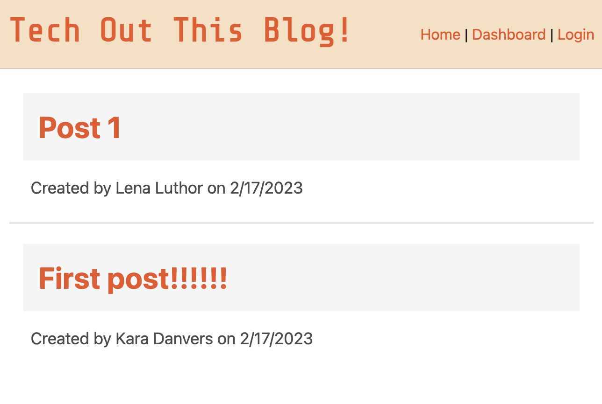
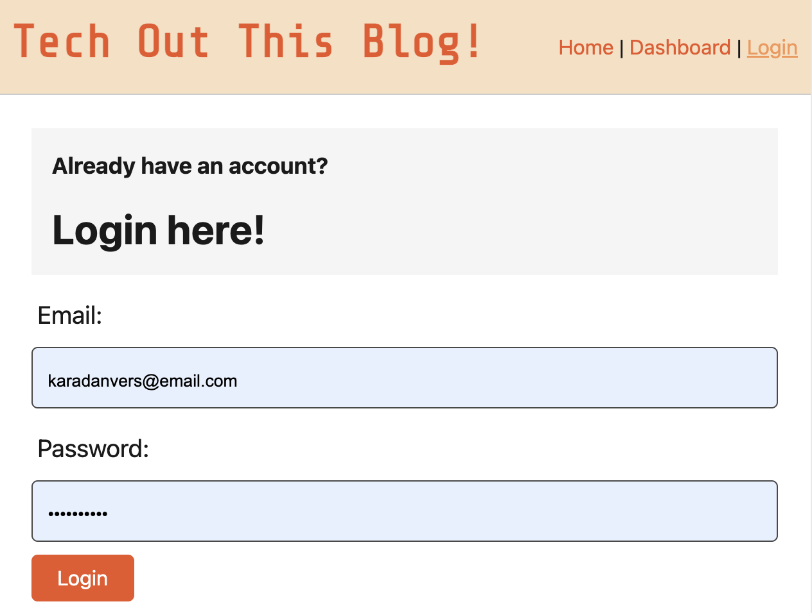
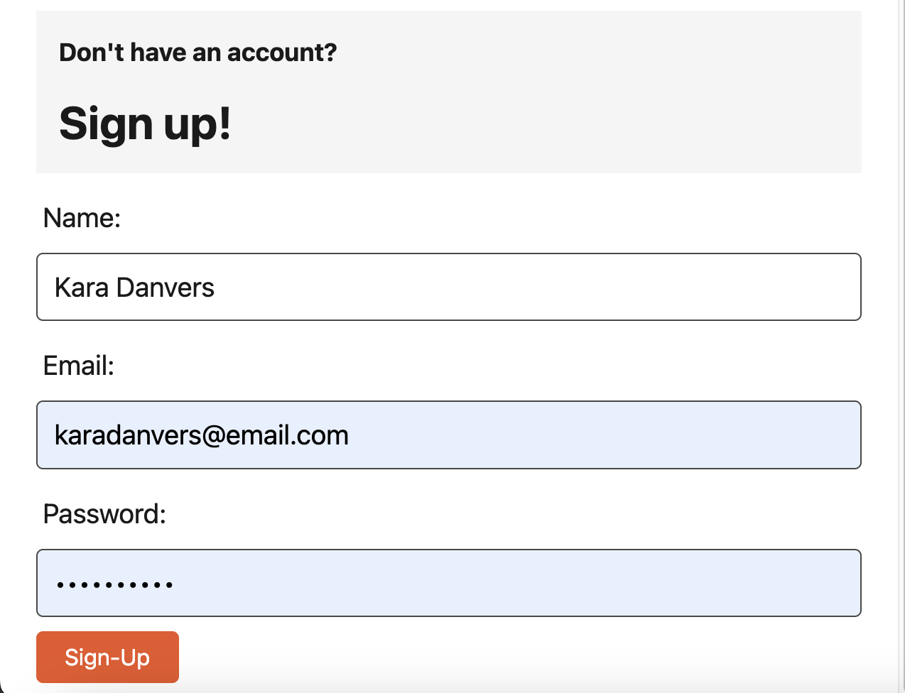
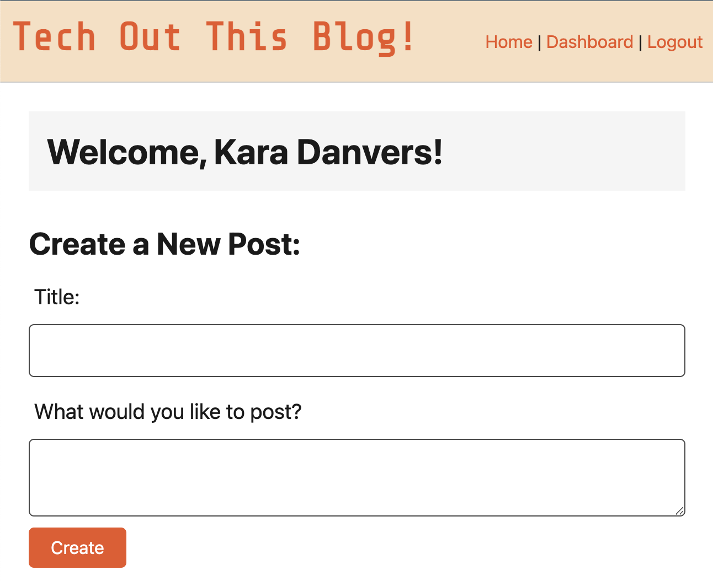
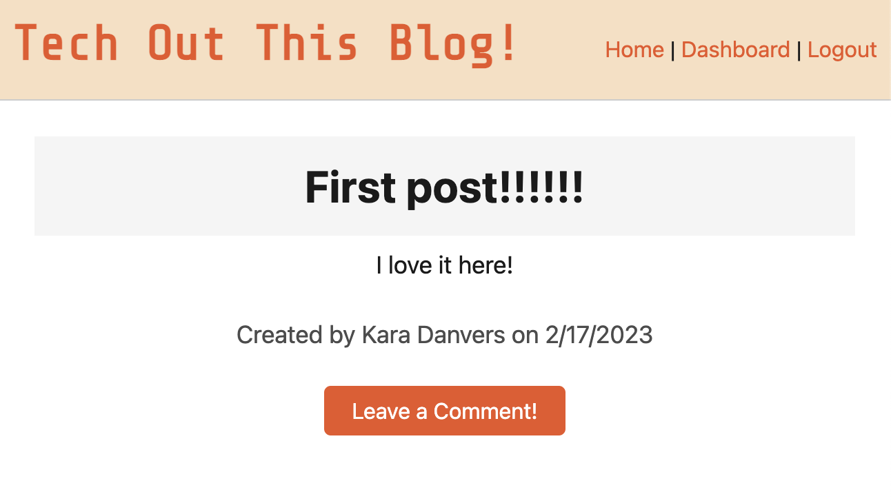

# Tech Vlog Slay

  ## Description
  CMS-style blog site similar to a Wordpress site, where developers can publish their blog posts and comment on other developers’ posts as well. 

  Tech Vlog Slay allows a user to create an account and make blog posts.

  ## Table of Contents
  * [Prerequisites](#prerequisites)
  * [Installation](#installing)
  * [Usage](#usage)
  * [License](#license)
  * [Questions](#questions)

  ## Getting Started

  Access the deployed app here: 
  [Tech Vlog Slay](https://tech-vlog-slay.herokuapp.com/)

  ## Usage

  ### App Functionality

  Running the app for the first time, the user is presented with the homepage, which includes existing blog posts if any have been posted; navigation links for the homepage and the dashboard; and the option to log in.

  

  When a user clicks on the homepage option, they are taken to the homepage and presented with any exisiting blog posts that include the post title and the date created. If they click another navation link (Login or Dashboard), they are prompted to either sign up or sign in.

  

  If a user has previously created an account, they may sign in. Otherwise, a new account can be made using the forms.

  

  Creating an account/signing in will redirect the user to their dashboard. On their Dasshboard, Here they have the option of creating  a new blog post.

  The user will also now see the option to Logout.

  

  The user will also see a list of previously posted blog posts. They are able to click into them to view or delete them if they wish to.

  

  When a user clicks on an existing blog post, they are presented with the post title, contents, post creator’s username, and date created for that post and have the option to leave a comment.

  

  <!-- WHEN I enter a comment and click on the submit button while signed in THEN the comment is saved and the post is updated to display the comment, the comment creator’s username, and the date created -->

  ## License
  N/A

  ## Questions
  For inquiries, please email me at arboleda.jen@gmail.com or visit my [GitHub](https://github.com/internetjen)
